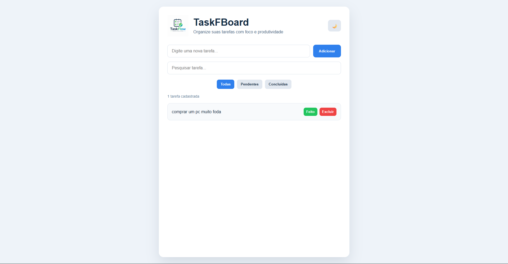

# 🚀 TaskFlow

TaskFlow é uma aplicação web desenvolvida para gerenciamento de tarefas diárias, permitindo organizar atividades de forma simples, rápida e eficiente.

O projeto foi criado com foco no aprendizado e prática de conceitos fundamentais do desenvolvimento Front-End, incluindo manipulação do DOM, armazenamento local de dados e criação de interfaces modernas e responsivas.

## ✨ Funcionalidades

* ➕ Adicionar novas tarefas
* ✅ Marcar tarefas como concluídas
* 🔄 Desfazer tarefas concluídas
* 🗑️ Excluir tarefas
* 🔍 Pesquisar tarefas em tempo real
* 📂 Filtrar tarefas:

  * Todas
  * Pendentes
  * Concluídas

* 🌙 Alternar entre tema claro e escuro
* 💾 Persistência de dados utilizando LocalStorage
* 📱 Interface responsiva para dispositivos móveis

## 🛠️ Tecnologias Utilizadas

* HTML5
* CSS3
* JavaScript (ES6+)
* LocalStorage

## 📚 Conceitos Praticados

Durante o desenvolvimento deste projeto foram aplicados conceitos como:

* Manipulação do DOM
* Eventos JavaScript
* Arrays e Objetos
* Métodos de array (`filter`, `forEach`)
* Template Literals
* LocalStorage
* Responsividade
* Organização de código
* Boas práticas de desenvolvimento Front-End

## 📷 Preview

### Tema Claro

### Tema Escuro

## 🎯 Objetivo

O objetivo deste projeto foi desenvolver uma aplicação funcional para gerenciamento de tarefas enquanto aprimorava conhecimentos em JavaScript, manipulação de dados e desenvolvimento de interfaces modernas.

## 👨‍💻 Autor

Desenvolvido por Iran Sousa.

---

⭐ Se você gostou do projeto, considere deixar uma estrela no repositório.
